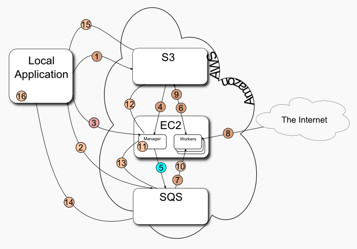

# Abstract
Code a real-world application to distributively apply OCR algorithms on images and display each 
image with its recognized text on a webpage.

# Table of contents
<!--ts-->
   * [System Architecture](#System-Architecture)
        * [Local Application](#Local-Application)
        * [The Manager](#manager)
        * [The Worker](#worker)
   * [Input and Output File Format ](#Input-and-Output-File-Format)  
   * [System flow ](#system-flow)  
   * [How to run](#How-to-run)
<!--te-->

System Architecture
=========
The system is composed of 3 elements: Local application,Manager and Workers
 The application will get as an input a text file containing a list of URLs of images. Then, instances will be launched in  AWS (workers and manager). Each worker will download image files, use some OCR library to identify text in those images (if any) and  display the image with the text in a webpage.
 The elements will communicate with each other using queues (SQS) and storage (S3).

## Local Application
The application resides on a local (non-cloud) machine. Once started, it reads the input file from the user and:
 * Checks if a Manager node is active on the EC2 cloud. If it is not, the application will start the manager node.
 * Uploads the file to S3.
 * Sends a message to an SQS queue, stating the location of the file on S3
 * Checks an SQS queue for a message indicating the process is done and the response (the summary file) is available on S3.
 * Downloads the summary file from S3, and create an html file representing the results.
 * Sends a termination message to the Manager if it was supplied as one of its input arguments.
 There can be more than one than one local application running at the same time, and requesting service from the manager.

## The Manager
The manager process resides on an EC2 node. It checks a special SQS queue for messages from local applications.
 Once it receives a message it:
 If the message is that of a new task it:
* Downloads the input file from S3.
* Creates an SQS message for each URL in the input file together with the operation that should be performed on it.
* Checks the SQS message count and starts Worker processes (nodes) accordingly.
* The manager creates a worker for every n messages, if there are no running workers.
* If there are k active workers, and the new job requires m workers, then the manager creates m-k new workers, if possible.
* If the message is a termination message, then the manager:
* Does not accept any more input files from local applications.
* Waits for all the workers to finish their job, and then terminates them.
* Creates response messages for the jobs, if needed.
* Terminates. 
 the manager process requests from local applications simultaneously; meaning, it must not handle each request at a time,  but rather work on all requests in parallel.

 ## The Worker
 A worker process resides on an EC2 node. Its life cycle is as follows:
 Repeatedly: 
* Get an image message from an SQS queue.
* Download the image file indicated in the message.
* Apply OCR on the image.
* Notify the manager of the text associated with that image.
* remove the image message from the SQS queue. 
 
 If an exception occurs, then the worker recover from it, send a message to the manager of the input message that caused the exception together with a short description of the exception, and continue working on the next message. 
If a worker stops working unexpectedly before finishing its work on a message, then some other worker handle that message.
 

Input and Output File Format
=========
The input file is a list of URLs, one URL per line.
 The output is an html file, containing the result images with links to the original images.
 A sample input file can be found [**here.**](https://s3.amazonaws.com/dsp132/text.images.txt) 
 A sample output file can be found [**here.**](https://s3.amazonaws.com/dsp132/text.images.html) 
If an exception occurs while performing an operation on an image, or the image file is not available,
 then output line for this file will be: : input file <a short description of the exception>. 
 
System flow
=========

  
 1.Local Application uploads the file with the list of images to S3 
 2.Local Application sends a message (queue) stating of the location of the images list on S3  
 3.Local Application does one of the two:  
  * Starts the manager  
  * Checks if a manager is active and if not, starts it  
 4.Manager downloads list of images  
 5.Manager creates an SQS message for each URL in the list of images  
 6.Manager bootstraps nodes to process messages  
 7.Worker gets an image message from an SQS queue  
 8.Worker downloads the image indicated in the message  
 10.Worker applies OCR on image.  
 11.Worker puts a message in an SQS queue indicating the original URL of the image and the text.  
 12.Manager reads all the Workers' messages from SQS and creates one summary file  
 13.Manager uploads summary file to S3  
 14.Manager posts an SQS message about summary file  
 15.Local Application reads SQS message  
 16.Local Application downloads summary file from S3  
 16.Local Application creates html output files  
 
How to run
=========
Please make sure you have maven and Amazon CLI installed on your machine.
 1.Clone the projet.
2.Update the credentials file on your machine with your AWS credentials.
 3.Open the terminal in the folder and run: mvn compile
 4.run: mvn exec:java -Dexec.mainClass=localapp.Main -Dexec.args="x y n terminate 
 where x is the input file name (should be in the directory of the project),
  y is the output file name, n is the workers - files ratio (how many image files per worker) 
  and terminate (optional) if you want to terminate the manager at the end of the run.

